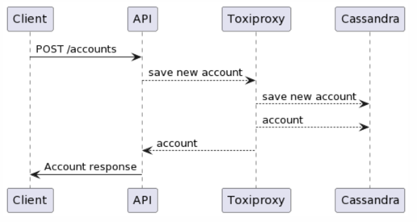
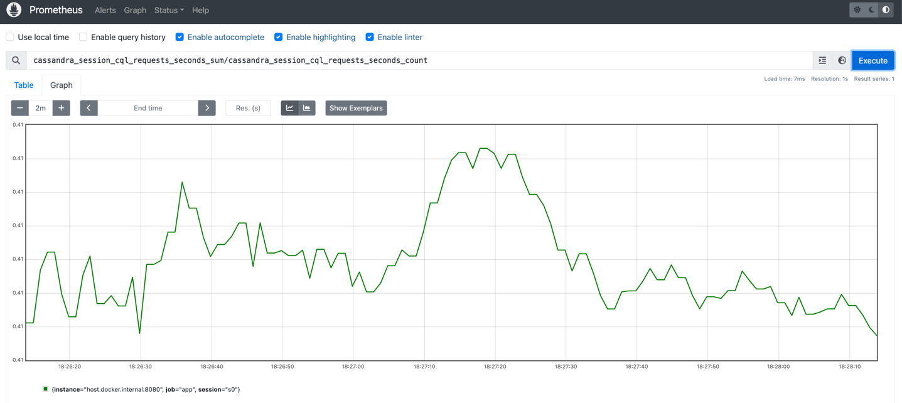
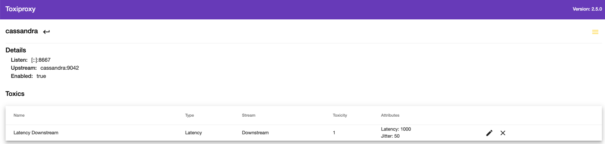

# cassandra-playground

Start the application locally using `TestPlaygroundCassandraApplication`
It uses the `TestContainersConfiguration` class to start cassandra and toxiproxy containers before the application



Create an account: 

```bash
curl -v -d "{\"name\":\"asdasdas\"}" -H "Content-Type: application/json" -X POST http://localhost:8080/accounts
```
```
* Connected to localhost (127.0.0.1) port 8080 (#0)
> POST /accounts HTTP/1.1
> Host: localhost:8080
> User-Agent: curl/7.87.0
> Accept: */*
> Content-Type: application/json
> Content-Length: 19
> 
* Mark bundle as not supporting multiuse
< HTTP/1.1 200 
< Content-Type: application/json
< Transfer-Encoding: chunked
< Date: Mon, 01 Apr 2024 18:52:13 GMT
< 
* Connection #0 to host localhost left intact
{"id":"fbeea74e-6788-42b2-8832-110671c814a5","name":"asdasdas"}%
```
List accounts
```bash
curl -v http://localhost:8080/accounts
```
```
* Connected to localhost (127.0.0.1) port 8080 (#0)
> GET /accounts HTTP/1.1
> Host: localhost:8080
> User-Agent: curl/7.87.0
> Accept: */*
> 
* Mark bundle as not supporting multiuse
< HTTP/1.1 200 
< Content-Type: application/json
< Transfer-Encoding: chunked
< Date: Mon, 01 Apr 2024 18:52:47 GMT
< 
* Connection #0 to host localhost left intact
[{"id":"fbeea74e-6788-42b2-8832-110671c814a5","name":"asdasdas"}]
```
We can use Prometheus to scrape metrics from the application
```bash
docker-compose -f docker/docker-compose.metrics.yaml up
```
Access Prometheus from: http://localhost:9090/graph
and check `cassandra_session_cql_requests_seconds_sum/cassandra_session_cql_requests_seconds_count`


We can use the local toxiproxy ui to change the network latency

