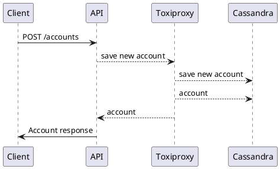

# cassandra-playground

Start the application locally using `TestPlaygroundCassandraApplication`
It uses the `TestContainersConfiguration` class to start cassandra and toxiproxy containers before the application

